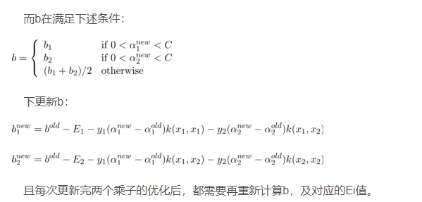

# 机器学习实验

## 贝叶斯分类器在鸢尾花数据集的实现

最简单的，我们选用朴素贝叶斯分类来实现。这部分原理与公式我在课程笔记中有提到。

[笔记地址](https://www.zwn-blog.xyz/2023/03/01/%E6%9C%BA%E5%99%A8%E5%AD%A6%E4%B9%A0/#%E8%B4%9D%E5%8F%B6%E6%96%AF%E5%88%86%E7%B1%BB%E5%99%A8)

### 知识回顾

#### 基本知识：贝叶斯定理

首先，贝叶斯定理：
$$P(c\ |\ \mathbf{x}) = \frac{P(\mathbf{x}\ |\ c) P(c)}{P(\mathbf{x})}$$
在贝叶斯定理中，每个概率都有约定俗成的名称：

- $P(c\ |\ \mathbf{x})$ 是类标记 $c$ 相对于样本 $\mathbf{x}$ 的条件概率，也由于得自 $\mathbf{x}$ 的取值而被称作 $c$ 的后验概率。
- $P(\mathbf{x}\ |\ c)$ 是样本 $\mathbf{x}$ 相对于类标记 $c$ 的**类条件概率（class-conditional probability）**，或称为**似然（likelihood）**，也由于得自 $c$ 的取值而被称作 $\mathbf{x}$ 的**后验概率**。
- $P(c)$ 是 $c$ 的先验概率（也称为边缘概率），之所以称为"先验"是因为它不考虑任何 $\mathbf{x}$ 方面的因素。在这里又称为**类先验（prior）概率**。
- $P(\mathbf{x})$ 是 $\mathbf{x}$ 的先验概率。在这里是用作归一化的**证据（evidence）因子**，与类标记无关。

有了贝叶斯定理，如何估计后验概率 $P(c\ |\ \mathbf{x})$ 的问题就转化为如何计算类先验概率 $P(c)$ 和类条件概率 $P(\mathbf{x}\ |\ c)$了。

类先验概率 $P(c)$ 表示的是**样本空间中各类样本的比例**，根据大数定律，**当训练集包含足够多的独立同分布样本**时，类先验概率可以直接通过**训练集中各类样本出现的频率**进行估计。

类条件概率 $P(\mathbf{x}\ |\ c)$ 的情况就复杂多了，它涉及到类 $c$ 中**样本 $\mathbf{x}$ 所有属性的联合概率**，假设每个样本有 $d$ 个二值属性，那么可能的取值组合就多达 $2^d$ 个，这个数目可能**远多于训练集的规模**，也就意味着很多样本的取值没有在训练集中出现，所以**直接用训练集出现的频率进行估计是不可行的**。必须注意**未被观测到**和**出现概率为0**的区别。

同时，在笔记中我也提到，上述讨论中，均假设属性是离散型，对于连续型属性，只需把概率质量函数 $P(\cdot)$ 换为概率密度函数 $p(\cdot)$ 就可以了。这是非常关键的一点。

> 注：改为连续型后，类标记 $c$ 改用 $y_i$ 表示，以表示其连续性，不影响表述。

#### 朴素贝叶斯分类器

我们前面提到了，估计后验概率 $P(y_j\ |\ \mathbf{x})$ 最大的一个难处是：类条件概率 $P(\mathbf{x}\ |\ y_j)$ 是所有属性上的联合概率，而多个属性的不同属性值组合并不一定全部囊括在训练集内，所以很难通过训练集估计。

为了避免这个障碍，**朴素贝叶斯分类器**采用**属性条件独立性假设（attribute conditional independence assumption）**。也就是说，假设**所有属性相互独立，单独地对分类结果产生影响**。

基于这个假设，可以把类条件概率写成连乘的形式，因此贝叶斯定理可重写为：

$$P(y_j\ |\ \mathbf{x}) = \frac{P(\mathbf{x}\ |\ y_j) \times P(y_j)}{P(\mathbf{x})} = \frac{P(y_j)}{P(\mathbf{x})} \prod_{i=1}^{d} P(x_i\ |\ y_j)\tag{1}$$
其中 $d$ 为属性数目， $x_i$ 为样本 $\mathbf{x}$ 在第 $i$ 个属性上的取值。

又因为 $P(\mathbf{x})$ 与类别无关，所以**朴素贝叶斯分类器的表达式**可以写为：
$$h(\mathbf{x}) = \arg \max_{c \in \mathcal{Y}} P(y_j) \prod_{i=1}^{d} P(x_i\ |\ y_j)$$
也即：
$$P(y_j\ |\ \mathbf{x}) = \dfrac{h(\mathbf x)}{P(\mathbf x)}$$
我们通常假定连续型属性服从高斯分布，则：
$$p(x_i\ |\ y_i) \sim \mathcal{N}(\mu_{y_i,i},\sigma_{y_i,i}^2)$$
即：
$$P(x_i|y_j)=\frac{1}{\sqrt{2\pi}\sigma_{ij}}e^-\frac{(x_i-\mu_{ij})^2}{2\sigma_{ij}^2}\tag{2}$$
这样一来整体的思路也就明晰了

&nbsp;

### 代码实现

```python
import numpy as np
from sklearn.datasets import load_iris
from sklearn.model_selection import train_test_split
import math

global label, dataColumns


class NB:

    def __init__(self):
        self.sigma = None
        self.mu = None
        self.y_unique = None
        self.y = None
        self.x = None

    def fit(self, x1, y1):
        self.x = x1
        self.y = y1
        # 去除y中重复的元素，并按元素由大到小返回一个新的无元素重复的元组或者列表
        self.y_unique = np.unique(y1)
        self.mu = np.zeros((len(self.y_unique), dataColumns), dtype=float)
        self.sigma = np.zeros((len(self.y_unique), dataColumns), dtype=float)

    def ge_mu_and_sigma(self):
        sum_mu = np.zeros((len(self.y_unique), dataColumns), dtype=float)

        sum_sigma = np.zeros((len(self.y_unique), dataColumns), dtype=float)

        for j in range(len(self.y_unique)):
            num_y = np.sum(self.y == self.y_unique[j])

            for i in range(len(self.x)):
                if self.y[i] == self.y_unique[j]:
                    sum_mu[j][0] += self.x[i][0]
                    sum_mu[j][1] += self.x[i][1]
                    sum_mu[j][2] += self.x[i][2]
                    sum_mu[j][3] += self.x[i][3]
            for k in range(4):
                self.mu[j][k] = sum_mu[j][k] / num_y

            for i in range(len(self.x)):
                if self.y[i] == self.y_unique[j]:
                    sum_sigma[j][0] += (self.x[i][0] - self.mu[j][0]) * (self.x[i][0] - self.mu[j][0])
                    sum_sigma[j][1] += (self.x[i][1] - self.mu[j][1]) * (self.x[i][1] - self.mu[j][1])
                    sum_sigma[j][2] += (self.x[i][2] - self.mu[j][2]) * (self.x[i][2] - self.mu[j][2])
                    sum_sigma[j][3] += (self.x[i][3] - self.mu[j][3]) * (self.x[i][3] - self.mu[j][3])
            for k in range(4):
                self.sigma[j][k] = math.sqrt(sum_sigma[j][k] / num_y)

    def predict(self, x_test1):
        global label
        # labels存储每个测试数据的预测值
        mlabels = []
        # 对每个测试数据进行操作求maxP(x|yj)P(yj)
        for m in range(len(x_test1)):
            max_value = 0
            # p(x|yj)即p(X|0),p(X|1),p(X|2)
            for i in range(len(self.y_unique)):
                # 存储yj时的p(xi|yj)
                values1 = []
                # 训练集中Y=yj的数量
                fenmu = np.sum(self.y == self.y_unique[i])
                # 求p(xi|yj)
                for j in range(len(x_test1[m])):
                    value = np.exp(-(x_test1[m][j] - self.mu[i][j]) ** 2 / (2 * self.sigma[i][j] ** 2)) / (
                            math.sqrt(2 * math.pi) * self.sigma[i][j])
                    values1.append(value)
                value = 1
                # p(x1|yj)*p(x2|yj)*......
                for v in values1:
                    value = value * v
                # p(x1|yj)*p(x2|yj)*......*p(yj)
                value = value * (fenmu / len(self.y))
                if value >= max_value:
                    max_value = value
                    label = self.y_unique[i]

            mlabels.append(label)

        return mlabels


if __name__ == '__main__':
    dataColumns = 4
    iris = load_iris()
    x = iris.data
    y = iris.target
    x_train, x_test, y_train, y_test = train_test_split(x, y, test_size=0.25)
    NB = NB()
    NB.fit(x_train, y_train)
    NB.ge_mu_and_sigma()
    labels = NB.predict(x_test)
    print("测试集准确率：", np.sum(labels == y_test) / len(labels))

```

#### 代码思路简析

这段代码实现了一个朴素贝叶斯分类器。简单总结一下几个函数的作用：

1. `fit`: 训练模型，计算训练集中每个类别下每个特征的均值和标准差。
2. `ge_mu_and_sigma`: 计算每个类别下的均值和标准差。
3. `predict`: 预测测试集的输出值。

这个分类器只支持处理四个实数型特征，并且使用高斯分布作为每个特征的分布函数。具体来说，这里的高斯分布估计非常简单，通过训练集上每个类别下每个特征的均值和标准差计算。在预测过程中，模型会对每个测试样本求出每个类别的先验概率和后验概率，然后选取后验概率最大的类别作为预测输出值。

代码直接按照上面给出的公式分析进行编写，模仿了 `sklearn` 中的写法。定义朴素贝叶斯分类器 (`NB`) 类，初始化分类器的属性 `x,y`，分别代表鸢尾花数据以及对应下标的分类，`y_unique` 代表鸢尾花所有可能种类(list)，`mu,sigma`用于计算高斯分布中对应参数。

首先求出样本均值和方差(`mu,sigma`,即 $\mu,\sigma^2$）。然后使用式 $(1)(2)$ 按照上面的思路进行计算即可。

#### 实验结果


可以看出分类器表现还是比较不错的。

&nbsp;

### 一些补充与不足

#### 数据集读取

上面代码中使用 `sklearn` 读取了数据集，但如果是读取本地数据集也可以使用pandas，当然，也需要根据数据集特征进行一定修改，如下代码及注释：

```python
data = pandas.read_csv('iris.csv',header=None)
# 去掉最后一列（花的分类
x = data.drop([4],axis=1)
# 去掉第一行（表头
x = x.drop([0],axis=0)
x = np.array(x,dtype=float)
# 选出第四列花的分类数据
y=pd.Categorical(data[4]).codes
```

#### 一点不足

代码中依然使用了 `dataColumns = 4` 这样的定值，也就是说上面的贝叶斯分类器只能处理数据列为 4 的数据集，相对于 `sklearn` 的贝叶斯分类器来讲欠缺一定的灵活性。另外，代码中的一个不太优雅的设计是使用了全局变量，在 `predict` 函数中修改了 `label` 变量的取值。这么写虽然可以解决问题，但是容易引起不必要的混乱，我们可以将其改为一个实例变量或函数返回值。


### 改进

思路不变，改进代码。

```python
import numpy as np
from sklearn.datasets import load_iris
from sklearn.model_selection import train_test_split
from scipy.stats import norm


class NaiveBayes:

    def __init__(self):
        self.priors = None
        self.classes = None
        self.means = None
        self.stdevs = None

    def fit(self, X, Y):
        self.classes = np.unique(Y)
        self.means = np.zeros((len(self.classes), X.shape[1]))
        self.stdevs = np.zeros((len(self.classes), X.shape[1]))
        for i, cls in enumerate(self.classes):
            X_cls = X[Y == cls]
            self.means[i, :] = X_cls.mean(axis=0)
            self.stdevs[i, :] = X_cls.std(axis=0)
        self.priors = np.log(np.array([np.mean(Y == cls) for cls in self.classes]))

    def predict(self, X_test):
        mlabels = []
        for x in X_test:
            posteriors = []
            for i, cls in enumerate(self.classes):
                cond_prob = norm.logpdf(x, self.means[i, :], self.stdevs[i, :]).sum()
                posterior = self.priors[i] + cond_prob
                posteriors.append(posterior)
            mlabels.append(self.classes[np.argmax(posteriors)])
        return mlabels


if __name__ == '__main__':
    iris = load_iris()
    X_train, X_test, y_train, y_test = train_test_split(iris.data, iris.target, test_size=0.25)
    clf = NaiveBayes()
    clf.fit(X_train, y_train)
    y_pred = clf.predict(X_test)
    accuracy = np.mean(y_pred == y_test)
    print("测试集准确率：", accuracy)

```

参数解释：

1. `classes`: 存储训练数据中的类别。
2. `means`: 存储各个类别在各个特征上的均值。
3. `stdevs`: 存储各个类别在各个特征上的标准差。
4. `priors`: 存储各个类别的先验概率。

改进之处：

1. 使用 `scipy.stats` 中的 `norm` 函数来代替手写函数，简化了代码。
2. 用 `np.mean` 代替手动统计分类样本数目的代码，简化了代码。
3. 将 `label` 变量改为了 `mlabels` 的返回值，避免了全局变量可能带来的混乱。
4. 将实数型特征的数据集的处理拓展到多个（不局限于4个）

#### 实验结果

理论上，代码是等价的，如图


&nbsp;

## KNN在鸢尾花数据集上的实现

### 知识回顾

这部分总结同样来自我的笔记。

**KNN的原理就是当预测一个新的值x的时候，根据它距离最近的K个点是什么类别来判断x属于哪个类别**。

思路是：**如果一个样本在特征空间中的k个最邻近的样本中的大多数属于某一个类别，则该样本也划分为这个类别。** KNN算法中，所选择的邻居都是**已经正确分类**的对象。该方法在定类决策上只依据最邻近的一个或者几个样本的类别来决定待分样本所属的类别。


该算法假定所有的实例对应于N维欧式空间 $A_n$ 中的点。通过计算一个点与其他所有点之间的距离，取出**与该点最近的K个点**，然后统计这K个点里面所属分类比例最大的，则这个点属于该分类。

该算法涉及3个主要因素：**实例集**、**距离或相似的衡量**、**k的大小**。

一个实例的最近邻是根据标准欧氏距离定义的。更精确地讲，把任意的实例x表示为下面的**特征向量**：

$$<a_1(x)，a_2(x)，...，a_n(x)>$$
其中 $a_r(x)$ 表示实例 $x$ 的第 $r$ 个属性值。那么两个实例 $x_i$ 和 $x_j$ 间的距离定义为 $d(x_i,x_j)$，其中： 

$$r =  d(x_i,x_j)=\sqrt{\sum\nolimits_{i=1}^{n} [a_r(x_i)−a_r(x_j)]^2}$$

实验中我选择使用欧式距离，使用K折交叉验证确定对于鸢尾花数据集最合适的K值。

&nbsp;

### 代码实现

```python
import numpy as np
from sklearn.datasets import load_iris
from sklearn.metrics import accuracy_score
from sklearn.model_selection import train_test_split, KFold
import matplotlib.pyplot as plt
import matplotlib


class KNNClassifier:
    def __init__(self, k=3):
        self.k = k
        self.x_train = None
        self.y_train = None

    def fit(self, x, y):
        self.x_train = x
        self.y_train = y
        return self

    def predict(self, x_test):
        mlabels = []
        for x in x_test:
            distances = [np.sqrt(np.sum((x_train - x) ** 2)) for x_train in self.x_train]
            nearest = np.argsort(distances)[:self.k]
            top_k_y = [self.y_train[index] for index in nearest]
            d = {}
            for cls in top_k_y:
                d[cls] = d.get(cls, 0) + 1
            d_list = list(d.items())
            d_list.sort(key=lambda x: x[1], reverse=True)
            if len(d_list) > 0:
                mlabels.append(d_list[0][0])
        return mlabels


if __name__ == '__main__':
    iris = load_iris()

    X_train, X_test, y_train, y_test = train_test_split(iris.data, iris.target, test_size=0.3)

    k_values = range(1, 31)
    kf = KFold(n_splits=5)

    mean_accuracy_values = []
    for k in k_values:
        accuracy_values = []
        for train_index, val_index in kf.split(X_train, y_train):
            X_train_fold, X_val_fold = X_train[train_index], X_train[val_index]
            y_train_fold, y_val_fold = y_train[train_index], y_train[val_index]

            knn = KNNClassifier(k=k)
            knn.fit(X_train_fold, y_train_fold)
            y_pred_val = knn.predict(X_val_fold)

            accuracy_values.append(accuracy_score(y_val_fold, y_pred_val))

        mean_accuracy = np.mean(accuracy_values)
        mean_accuracy_values.append(mean_accuracy)

    matplotlib.use('TkAgg')
    plt.plot(k_values, mean_accuracy_values)
    plt.title("Cross-Validation Accuracy over k")
    plt.xlabel("k")
    plt.ylabel("Accuracy")
    plt.show()

    best_k = k_values[np.argmax(mean_accuracy_values)]
    print(f"Best value of k: {best_k}")

    knn = KNNClassifier(k=best_k)
    knn.fit(X_train, y_train)
    y_pred_test = knn.predict(X_test)
    test_accuracy = accuracy_score(y_test, y_pred_test)
    print(f"Test accuracy with k={best_k}: {test_accuracy:.2f}")

```

### 代码思路

#### `predict(self, x_test)`

这是一个实现KNN分类算法预测的方法，并根据最近的数据点来确定测试数据点所属的类别。

函数的输入为一个测试集数据向量`x_test`。对于每个测试数据点，函数首先计算其与训练集所有数据点的距离。然后，函数根据最近的K个邻居（距离最近的K个训练数据点）来决定测试数据点的类别。

距离度量方法，这里使用欧几里得距离度量方法：

```python
distances = [np.sqrt(np.sum((x_train - x) ** 2)) for x_train in self.x_train]
```

代码计算和存储每个训练数据点与测试数据点之间的欧几里得距离。接下来，我们使用`argsort`函数返回排序后的索引数组，即一个由最近的到最远的K个邻居的训练数据点组成的数组：

```python
nearest = np.argsort(distances)[:self.k]
```

然后，我们根据K个邻居的类别计算出每个类别的出现次数：

```python
d = {}
for cls in top_k_y:
    d[cls] = d.get(cls, 0) + 1
```

使用`d.items()`将字典d中的所有元素以列表返回，列表中的每个元素由(key, value)构成。然后，我们按照value从大到小对字典中的值进行排序：

```python
d_list = list(d.items())
d_list.sort(key=lambda x: x[1], reverse=True)
```

最后，函数将出现次数最大的那个类别添加到`mlabels`列表中，该列表将包含每个测试数据点的预测类别。最终，函数返回`mlabels`列表。


#### K折交叉验证

1. 从Scikit-learn中加载iris数据集，并将其划分为训练和测试数据：

```python
iris = load_iris()
X_train, X_test, y_train, y_test = train_test_split(iris.data, iris.target, test_size=0.3)
```

1. 确定KNN中的最优K值。我们对1到30的K值进行5折交叉验证，并选择具有最高交叉验证准确度的K值:

```python
k_values = range(1, 31)
kf = KFold(n_splits=5)

mean_accuracy_values = []
for k in k_values:
    accuracy_values = []
    for train_index, val_index in kf.split(X_train, y_train):
        X_train_fold, X_val_fold = X_train[train_index], X_train[val_index]
        y_train_fold, y_val_fold = y_train[train_index], y_train[val_index]

        knn = KNNClassifier(k=k)
        knn.fit(X_train_fold, y_train_fold)
        y_pred_val = knn.predict(X_val_fold)

        accuracy_values.append(accuracy_score(y_val_fold, y_pred_val))

    mean_accuracy = np.mean(accuracy_values)
    mean_accuracy_values.append(mean_accuracy)

plt.plot(k_values, mean_accuracy_values)
plt.title("Cross-Validation Accuracy over k")
plt.xlabel("k")
plt.ylabel("Accuracy")
plt.show()

best_k = k_values[np.argmax(mean_accuracy_values)]
print(f"Best value of k: {best_k}")
```

1. 使用最优K值拟合整个训练数据，用于测试集上的预测，并计算测试集准确率：

```python
knn = KNNClassifier(k=best_k)
knn.fit(X_train, y_train)
y_pred_test = knn.predict(X_test)
test_accuracy = accuracy_score(y_test, y_pred_test)
print(f"Test accuracy with k={best_k}: {test_accuracy:.2f}")
```

在这个代码中，我们首先拟合每个K值（从1到30）上的训练集。然后，针对每个K值，我们在训练集上分割出5个不同的验证集，每个验证集占训练集数据的20%。我们使用由交叉验证的5个分割生成的验证集来评估该K值下训练的KNN分类器的表现。接下来，我们计算每个K值上五次验证的准确度的平均值，并将其存储在`mean_accuracy_values`列表中来绘制交叉验证的准确度和不同k值的关系。我们选择具有最高平均准确度的k作为最优k值，并使用该值训练一个新的KNN分类器（使用整个训练集）。最后，我们使用这个由最优K参数训练出的模型对测试集进行预测并计算与测试集实际结果之间的准确率。

### 运行结果


> 这里把`matplotlib.use('TkAgg')`注释掉了所以有warning，但是若不注释则会阻塞线程，无法显示`print`的执行结果。无伤大雅。

&nbsp;

### 一个问题：归一化

尝试使用Scikit-learn中的StandardScaler类来进行数据归一化，该类可以对数据进行标准化（即使得数据的均值为0，方差为1），同时将数据的值缩放到一个标准范围内。标准化的数据取值范围不会像归一化一样局限在0到1之间，因此可以更好地应对数据集中存在极端值的情况。

修改后的代码:

```python
import numpy as np
from sklearn.datasets import load_iris
from sklearn.metrics import accuracy_score
from sklearn.model_selection import train_test_split, KFold
from sklearn.preprocessing import StandardScaler
import matplotlib.pyplot as plt
import matplotlib

class KNNClassifier:
    def __init__(self, k=3):
        self.k = k
        self.x_train = None
        self.y_train = None

    def fit(self, x, y):
        self.x_train = x
        self.y_train = y
        return self

    def predict(self, x_test):
        mlabels = []
        for x in x_test:
            # replace MinMaxScaler with StandardScaler
            distances = [np.sqrt(np.sum(
                ((x_train - x) / np.std(self.x_train, axis=0)) ** 2)) for x_train in self.x_train]
            nearest = np.argsort(distances)[:self.k]
            top_k_y = [self.y_train[index] for index in nearest]
            d = {}
            for cls in top_k_y:
                d[cls] = d.get(cls, 0) + 1
            d_list = list(d.items())
            d_list.sort(key=lambda x: x[1], reverse=True)
            if len(d_list) > 0:
                mlabels.append(d_list[0][0])
        return mlabels


if __name__ == '__main__':
    iris = load_iris()

    X_train, X_test, y_train, y_test = train_test_split(iris.data, iris.target, test_size=0.3)

    scaler = StandardScaler()
    X_train = scaler.fit_transform(X_train)
    X_test = scaler.transform(X_test)

    k_values = range(1, 31)
    kf = KFold(n_splits=5)

    mean_accuracy_values = []
    for k in k_values:
        accuracy_values = []
        for train_index, val_index in kf.split(X_train, y_train):
            X_train_fold, X_val_fold = X_train[train_index], X_train[val_index]
            y_train_fold, y_val_fold = y_train[train_index], y_train[val_index]

            knn = KNNClassifier(k=k)
            knn.fit(X_train_fold, y_train_fold)
            y_pred_val = knn.predict(X_val_fold)

            accuracy_values.append(accuracy_score(y_val_fold, y_pred_val))

        mean_accuracy = np.mean(accuracy_values)
        mean_accuracy_values.append(mean_accuracy)

    # matplotlib.use('TkAgg')
    plt.plot(k_values, mean_accuracy_values)
    plt.title("Cross-Validation Accuracy over k")
    plt.xlabel("k")
    plt.ylabel("Accuracy")
    plt.show()

    best_k = k_values[np.argmax(mean_accuracy_values)]
    print(f"Best value of k: {best_k}")

    knn = KNNClassifier(k=best_k)
    knn.fit(X_train, y_train)
    y_pred_test = knn.predict(X_test)
    test_accuracy = accuracy_score(y_test, y_pred_test)
    print(f"Test accuracy with k={best_k}: {test_accuracy:.2f}")
```

我使用了`StandardScaler`函数，并在计算距离时使用数据集X_train的标准差来归一化。由于标准差包含了数据的缩放信息以及数据偏移信息，因此使用标准差进行归一化可以在保持数据缩放比例相同的同时，更好地保留数据的偏移信息。


发现随着K增加，准确率呈现下降趋势，推测是出现了过拟合。

&nbsp;

## 决策树在鸢尾花数据集的实现

### 知识回顾

> 这部分来自于我的课程笔记

**决策树（decision tree）**是一种模仿人类决策的学习方法。举个例子，比方说买电脑，我们首先看看外观帅不帅气，然后再看看性能怎么样，还得看看价格如何，最终**经过一系列的判断做出**是否购买电脑的**决策**。

一棵决策树可以分成三个部分：叶节点，非叶节点，分支。**叶节点**对应**决策结果**，也即分类任务中的类别标记；**非叶节点**（包括根节点）对应一个**判定问题**（某属性=？）；**分支**对应父节点**判定问题的不同答案**（可能的属性值），可能连向一个非叶节点的子节点，也可能连向叶节点。


决策就是从根节点开始走到叶节点的过程。每经过一个节点的判定，数据集就按照答案（属性值）划分为若干子集，**在子节点做判定时只需要考虑对应的数据子集就可以了**。

决策树学习的目的是为了**产生一棵泛化能力强，即处理未见示例能力强的决策树**。

或者可以这样理解：

决策树算法采用树形结构，使用层层推理来实现最终的分类。决策树由下面几种元素构成：

- 根节点：包含样本的全集
- 内部节点：对应特征属性测试
- 叶节点：代表决策的结果

预测时，在树的内部节点处用某一属性值进行判断，根据判断结果决定进入哪个分支节点，直到到达叶节点处，得到分类结果。这是一种基于 if-then-else 规则的有监督学习算法，决策树的这些规则通过训练得到，而不是人工制定的。

#### 生成算法

决策树生成是一个**递归过程**，生成算法：

> 1. 传入训练集和属性集
> 2. 生成一个新节点
> 3. 若此时数据集中所有样本都属于同一类，则把新节点设置为该类的叶节点，然后**返回**$^1$。
> 4. 若此时属性集为空，或者数据集中所有样本在属性集余下的所有属性上取值都相同，无法进一步划分，则把新节点设置为叶节点，类标记为数据集中样本数最多的类，然后**返回**$^2$
> 5. 从属性集中选择一个最优划分属性
>    - 为该属性的每个属性值生成一个分支，并按属性值划分出子数据集
>    - 若分支对应的子数据集为空，无法进一步划分，则直接把子节点设置为叶节点，类标记为父节点数据集中样本数最多的类，然后**返回**$^3$
>    - 将子数据集和去掉了划分属性的子属性集作为算法的传入参数，继续生成该分支的子决策树。

稍微注意一下，3处返回中的第2处和第3处设置叶节点的类标记原理有所不同。第2处将类标记设置为当前节点对应为数据集中样本数最多的类，这是利用当前节点的**后验分布**；第3处将类标记设置为为父节点数据集中样本数最多的类，这是把父节点的样本分布作为当前节点的**先验分布**。

#### 划分选择

在决策树模型中，我们不断进行判定的初衷是希望**划分后需要考虑的可能更少**，准确地说，是希望所得子节点的**纯度（purity）**更高（也可以说是混乱程度更低）。

**信息熵（information entropy**)是一种衡量样本集纯度的常用指标：
$$Ent(D) = -\sum_{k=1}^{|\mathcal{Y}|}p_klog_2p_k$$
**一定要记得最前面的负号**！！！其中 $|\mathcal{Y}|$ 为类别集合，$p_k$ 为该类样本占样本总数的比例。

**信息熵越大，表示样本集的混乱程度越高，纯度越低**。

##### 信息增益

**信息增益（information gain）**是**ID3算法**采用的选择准则，定义如下：

$$Gain(D,a) = Ent(D) - \sum_{v=1}^{V}\frac{|D^v|}{|D|}Ent(D^v)$$
它描述的是按某种属性划分后纯度的提升，**信息增益越大，代表用属性 $a$ 进行划分所获得的纯度提升越大**。其中 $V$ 表示属性 $a$ 的属性值集合，$D^v$ 表示属性值为 $v$ 的数据子集。求和项也称为**条件熵**，我们可以理解为它是先求出每个数据子集的信息熵，然后按每个数据子集占原数据集的比例来赋予权重，比例越大，对提升纯度的帮助就越大。

多个属性都取得最大的信息增益时，任选一个即可。

信息增益又称为**互信息（Mutual information）**。

- 一个连续变量X的不确定性，用方差Var(X)来度量
- 一个离散变量X的不确定性，用熵H(X)来度量
- 两个连续变量X和Y的相关度，用协方差或相关系数来度量
- 两个离散变量X和Y的相关度，用互信息I(X;Y)来度量(直观地，X和Y的相关度越高，X对分类的作用就越大)

##### 信息熵

熵（entropy）表示随机变量不确定性的度量，也就是熵越大，变量的不确定性就越大。设X是一个有限值的离散随机变量，其概率分布为：$P(X=x_i)=p_i,i=1,2,…,n$ 则随机变量 $X$ 的熵定义为： $H(X)=−∑_{i=1}^nlog_2p_i$ ( 若 $p_i=0$ ，定义$0\,log0=0$)

##### 基尼指数

**基尼指数（Gini index）**是**CART算法**采用的选择准则，定义如下：

基尼值：

$$Gini(D) = \sum_{k=1}^{|\mathcal{Y}|}\sum_{k' \neq k}p_kp_{k'}\=1-\sum_{k=1}^{|\mathcal{Y}|}p_k^2$$
基尼指数：

$$Gini\_index(D,a) = \sum_{v=1}^{V}\frac{|D^v|}{|D|}Gini(D^v)$$
基尼值是另一种衡量样本集纯度的指标。反映的是**从一个数据集中随机抽取两个样本，其类别标志不同的概率**。

**基尼值越小，样本集的纯度越高**。

由基尼值引伸开来的就是基尼指数这种准则了，**基尼指数越小，表示使用属性 $a$ 划分后纯度的提升越大**。

&nbsp;

### 代码实现

这段代码实现了基于最小基尼指数和信息增益的决策树算法。决策树的创建过程通过递归实现，对于每个节点，算法从样本中选取最优的特征和阈值，以此来划分数据集。如果划分后的样本数量太小，则会创建叶节点，否则继续递归创建左右子树。最终，创建以根节点为起始点的决策树。在预测过程中，根据决策树的规则，递归地进行节点遍历，直到遍历到叶节点为止，返回预测的类别标签。

```python
import numpy as np
from sklearn.datasets import load_iris
from sklearn.model_selection import train_test_split
import matplotlib.pyplot as plt
import matplotlib


# 定义节点类
class Node:
    def __init__(self, feature=None, threshold=None, left=None, right=None, value=None):
        self.feature = feature  # 分割特征
        self.threshold = threshold  # 分割阈值
        self.left = left  # 左子树
        self.right = right  # 右子树
        self.value = value  # 叶节点取值


# 定义决策树分类器
class DecisionTree:
    def __init__(self, max_depth=None, min_samples_split=2, min_samples_leaf=1):
        self.max_depth = max_depth  # 决策树最大深度
        self.min_samples_split = min_samples_split  # 内部节点最小样本数
        self.min_samples_leaf = min_samples_leaf  # 叶节点最小样本数
        self.root = None  # 决策树的根节点

    # 计算基尼指数
    def gini(self, y):
        classes = np.unique(y)
        n_sample = y.shape[0]
        gini = 0
        for cls in classes:
            gini += (np.sum(y == cls) / n_sample) ** 2
        return 1 - gini

    # 计算信息熵
    def entropy(self, y):
        classes = np.unique(y)
        n_sample = y.shape[0]
        entropy = 0
        for cls in classes:
            ratio = np.sum(y == cls) / n_sample
            entropy -= ratio * np.log2(ratio + 1e-9)
        return entropy

    # 计算信息增益
    def information_gain(self, x, y, feature, threshold):
        mask = x[:, feature] < threshold
        y_left, y_right = y[mask], y[~mask]
        if len(y_left) == 0 or len(y_right) == 0:
            return 0
        info_gain = self.entropy(y) - (len(y_left) / len(y)) * self.entropy(y_left) - (
                    len(y_right) / len(y)) * self.entropy(y_right)
        return info_gain

    # 按照最优特征和阈值分割数据集
    def split(self, x, y):
        max_info_gain = 0
        best_feature, best_threshold = None, None
        n_sample, n_feature = x.shape
        for feature in range(n_feature):
            thresholds = np.unique(x[:, feature])
            for threshold in thresholds:
                info_gain = self.information_gain(x, y, feature, threshold)
                if info_gain > max_info_gain:
                    max_info_gain = info_gain
                    best_feature = feature
                    best_threshold = threshold
        if best_feature is None:
            return None, None, None
        mask = x[:, best_feature] < best_threshold
        X_left, y_left = x[mask], y[mask]
        X_right, y_right = x[~mask], y[~mask]
        return best_feature, best_threshold, X_left, y_left, X_right, y_right

    # 计算叶节点取值
    def leaf_value(self, y):
        classes, counts = np.unique(y, return_counts=True)
        idx = np.argmax(counts)
        return classes[idx]

    # 创建决策树
    def build_tree(self, X, y, depth=0):
        n_sample, n_feature = X.shape
        n_cls = len(np.unique(y))
        # 如果样本全部属于同一个类别或深度达到最大深度或样本数量太少则创建叶节点
        if n_cls == 1 or depth == self.max_depth or n_sample < self.min_samples_split:
            leaf_value = self.leaf_value(y)
            return Node(value=leaf_value)
        # 按照最优特征和阈值分割数据集
        feature, threshold, X_left, y_left, X_right, y_right = self.split(X, y)
        # 如果分割后的样本数量太小则创建叶节点
        if X_left is None:
            leaf_value = self.leaf_value(y)
            return Node(value=leaf_value)
        # 如果分割后的样本数量少于叶节点最小样本数则创建叶节点
        if len(X_left) < self.min_samples_leaf or len(X_right) < self.min_samples_leaf:
            leaf_value = self.leaf_value(y)
            return Node(value=leaf_value)
        # 创建分割节点
        node = Node(feature, threshold)
        # 递归创建左右子树
        node.left = self.build_tree(X_left, y_left, depth + 1)
        node.right = self.build_tree(X_right, y_right, depth + 1)
        return node

    # 使用训练数据集创建决策树
    def fit(self, X, y):
        self.root = self.build_tree(X, y)

    # 预测单个样本的类别
    def _predict(self, x, node):
        if node.value is not None:
            return node.value
        if x[node.feature] < node.threshold:
            return self._predict(x, node.left)
        else:
            return self._predict(x, node.right)

    # 对测试数据集进行预测
    def predict(self, X_test):
        y_pred = []
        for i in range(X_test.shape[0]):
            y_pred.append(self._predict(X_test[i], self.root))
        return np.array(y_pred)


if __name__ == '__main__':
    iris = load_iris()

    matplotlib.use('TkAgg')

    # 决策树深度的影响
    depth = range(3, 13)
    accuracies = []
    X_train, X_test, y_train, y_test = train_test_split(iris.data, iris.target, test_size=0.25)

    for i in depth:
        clf = DecisionTree(max_depth=i, min_samples_split=2, min_samples_leaf=1)
        clf.fit(X_train, y_train)
        y_pred = clf.predict(X_test)
        accuracies.append(np.mean(y_pred == y_test))

    plt.plot(depth, accuracies)

    plt.xlabel("depth")
    plt.ylabel("Accuracy")
    plt.show()

```

#### 实验结果

实验结果如下，可见随着决策树深度上限的增加，准确率有一定的提升


### 改进：剪枝

我们可以考虑在该决策树上实现后向剪枝。具体步骤如下：

1. 通过从训练集中随机选择一部分数据（例如20%），用于剪枝的验证集。
2. 调用前面的`fit`方法来训练模型。
3. 从叶节点开始向上递归，将每个节点替换为一个叶节点并计算在验证集上的准确率。
4. 如果替换后的准确率比原来的准确率更高，则将该节点替换为叶节点，否则保留该节点。
5. 重复步骤3和步骤4，直到无法继续剪枝或所有节点都被剪枝为止。

#### 具体的实现

```python
import numpy as np
from sklearn.datasets import load_iris
from sklearn.model_selection import train_test_split
import matplotlib.pyplot as plt
import matplotlib


# 定义节点类
class Node:
    def __init__(self, feature=None, threshold=None, left=None, right=None, value=None):
        self.feature = feature  # 分割特征
        self.threshold = threshold  # 分割阈值
        self.left = left  # 左子树
        self.right = right  # 右子树
        self.value = value  # 叶节点取值


# 定义决策树分类器
class DecisionTree:
    def __init__(self, max_depth=None, min_samples_split=2, min_samples_leaf=1):
        self.max_depth = max_depth  # 决策树最大深度
        self.min_samples_split = min_samples_split  # 内部节点最小样本数
        self.min_samples_leaf = min_samples_leaf  # 叶节点最小样本数
        self.root = None  # 决策树的根节点

    # 计算基尼指数
    def gini(self, y):
        classes = np.unique(y)
        n_sample = y.shape[0]
        gini = 0
        for cls in classes:
            gini += (np.sum(y == cls) / n_sample) ** 2
        return 1 - gini

    # 计算信息熵
    def entropy(self, y):
        classes = np.unique(y)
        n_sample = y.shape[0]
        entropy = 0
        for cls in classes:
            ratio = np.sum(y == cls) / n_sample
            entropy -= ratio * np.log2(ratio + 1e-9)
        return entropy

    # 计算信息增益
    def information_gain(self, x, y, feature, threshold):
        mask = x[:, feature] < threshold
        y_left, y_right = y[mask], y[~mask]
        if len(y_left) == 0 or len(y_right) == 0:
            return 0
        info_gain = self.entropy(y) - (len(y_left) / len(y)) * self.entropy(y_left) - \
                    (len(y_right) / len(y)) * self.entropy(y_right)
        return info_gain

    # 按照最优特征和阈值分割数据集
    def split(self, x, y):
        max_info_gain = 0
        best_feature, best_threshold = None, None
        n_sample, n_feature = x.shape
        for feature in range(n_feature):
            thresholds = np.unique(x[:, feature])
            for threshold in thresholds:
                info_gain = self.information_gain(x, y, feature, threshold)
                if info_gain > max_info_gain:
                    max_info_gain = info_gain
                    best_feature = feature
                    best_threshold = threshold
        if best_feature is None:
            return None, None, None
        mask = x[:, best_feature] < best_threshold
        X_left, y_left = x[mask], y[mask]
        X_right, y_right = x[~mask], y[~mask]
        return best_feature, best_threshold, X_left, y_left, X_right, y_right

    # 计算叶节点取值
    def leaf_value(self, y):
        classes, counts = np.unique(y, return_counts=True)
        idx = np.argmax(counts)
        return classes[idx]

    # 创建决策树
    def build_tree(self, X, y, depth=0):
        n_sample, n_feature = X.shape
        n_cls = len(np.unique(y))
        # 如果样本全部属于同一个类别或深度达到最大深度或样本数量太少则创建叶节点
        if n_cls == 1 or depth == self.max_depth or n_sample < self.min_samples_split:
            leaf_value = self.leaf_value(y)
            return Node(value=leaf_value)
        # 按照最优特征和阈值分割数据集
        feature, threshold, X_left, y_left, X_right, y_right = self.split(X, y)
        # 如果分割后的样本数量太小则创建叶节点
        if X_left is None:
            leaf_value = self.leaf_value(y)
            return Node(value=leaf_value)
        # 如果分割后的样本数量少于叶节点最小样本数则创建叶节点
        if len(X_left) < self.min_samples_leaf or len(X_right) < self.min_samples_leaf:
            leaf_value = self.leaf_value(y)
            return Node(value=leaf_value)
        # 创建分割节点
        node = Node(feature, threshold)
        # 递归创建左右子树
        node.left = self.build_tree(X_left, y_left, depth + 1)
        node.right = self.build_tree(X_right, y_right, depth + 1)
        return node

        # 剪枝函数

    def prune(self, node, X_val, y_val):
        if node.left is None and node.right is None:
            return False
        # 遍历左右子树，并记录下所有叶节点
        if node.left and not self.prune(node.left, X_val, y_val):
            return False
        if node.right and not self.prune(node.right, X_val, y_val):
            return False
        # 保存子树，接下来我们将尝试裁剪它
        tmp_left = node.left
        tmp_right = node.right
        # 裁剪子树，将其变为一个叶节点
        node.left = None
        node.right = None
        # 计算裁剪前的准确率
        y_pred = self.predict(X_val)
        accuracy_before = np.mean(y_pred == y_val)
        # 计算裁剪后的准确率
        leaf_value = self.leaf_value(y_val)
        y_pred = [leaf_value] * len(y_val)
        accuracy_after = np.mean(y_pred == y_val)
        if accuracy_before <= accuracy_after:
            # 裁剪后的准确率更高，则保留剪枝后的叶节点
            node.left = tmp_left
            node.right = tmp_right
            return False
        else:
            # 裁剪后的准确率更低，则保留未剪枝的节点
            return True

    # 使用训练数据集创建决策树
    def fit(self, X, y):
        X_train, X_val, y_train, y_val = train_test_split(X, y, test_size=0.2)  # 随机选择20%的数据作为验证集
        self.root = self.build_tree(X_train, y_train)
        self.prune(self.root, X_val, y_val)  # 剪枝

    # 预测单个样本的类别
    def _predict(self, x, node):
        if node.value is not None:
            return node.value
        if x[node.feature] < node.threshold:
            return self._predict(x, node.left)
        else:
            return self._predict(x, node.right)

    # 剪枝后的预测函数
    def predict(self, X):
        assert self.root is not None, "build_tree at first"
        y = []
        for x in X:
            node = self.root
            while node.left:
                if x[node.feature] < node.threshold:
                    node = node.left
                else:
                    node = node.right
            y.append(node.value)
        return np.array(y)


if __name__ == '__main__':
    iris = load_iris()

    matplotlib.use('TkAgg')

    # 决策树深度的影响
    depth = range(3, 13)
    accuracies = []
    X_train, X_test, y_train, y_test = train_test_split(iris.data, iris.target, test_size=0.25)

    for i in depth:
        clf = DecisionTree(max_depth=i, min_samples_split=2, min_samples_leaf=1)
        clf.fit(X_train, y_train)
        y_pred = clf.predict(X_test)
        accuracies.append(np.mean(y_pred == y_test))

    plt.plot(depth, accuracies)

    plt.xlabel("depth")
    plt.ylabel("Accuracy")
    plt.show()


```

#### 实验结果

可见在各个深度下，剪枝后的决策树准确率有提升，但提升不多。

一方面是由于原本代码准确率已经比较不错，另一方面我觉得是样本量较少，所以剪枝影响不大。


&nbsp;

## SVM在鸢尾花数据集的实现

### 基本知识与思路

首先我使用 `sklearn` 中的现成SVM对鸢尾花数据集进行学习、预测，尝试了线性硬间隔、线性软间隔、非线性SVM后，最终确定非线性SVM更适合于该数据集。

对于非线性SVM，我们可以利用核技巧很简单地把线性支持向量机扩展到非线性支持向量机，**只需将线性支持向量机中的內积换成核函数即可**。

* 首先选取适当的核函数 $K(x,z)$ 和适当的参数 $C$，构造最优化问题  

  $$\begin{aligned} & \underset{\alpha}{min} \quad \frac 1 2 \sum_{i=1}^n \sum_{j=1}^n \alpha_i \alpha_j y_i y_j K(X_i,X_j) \ - \ \sum_{i=1}^n \alpha_i \\\\ & s.t. \quad \sum_{i=1}^n \alpha_i y_i = 0 \\\\ & \qquad 0 \le \alpha_i \le C, i=1,2,…,n. \end{aligned} $$

  再利用现成的二次规划问题求解算法或者 SMO 算法求得最优解 $\hat{\alpha}$ 。

* 选择 $\hat{\alpha}$ 的满足 $0 < \hat{\alpha}_j < C$ 的分量 $\hat{\alpha}_j$ ，计算截距

  $$\hat{b} = y_j-\sum_{i \in SV} \hat{\alpha}_i y_i K(X_j,X_i) $$

* 决策函数：  

  $$f(x)=sign(\sum_{i \in SV}\hat{\alpha}_i y_i K(X_j,X_i) + \hat{b}) $$

#### 更细节地讲

- 首先计算核矩阵K：

$$K_{i,j}=K(x_i,x_j)$$

核函数我选择使用高斯核函数
$$K(x,z) = exp(- \frac {||x-z||^2} {2 \sigma^2} )$$


- 初始化拉格朗日乘子 $\alpha$，直接将其置为全0即可


- 对每次循环（不超过最大迭代次数前提下）：
  - 首先复制原有的 $\alpha$：
    $$\alpha_{old} = \alpha$$
  
  - 对第 $i$ 个样本（$i \in [0,n],n=len(X_{train})$：
  
    - 计算预测值和误差：
      $$E_i = f(x_i) - y_i = \sum_{j=1}^n \alpha_j y_j K(x_i,x_j) + b-y_i$$
  
    - 计算 KKT 条件：
      $$\begin{cases}y_i\cdot E_i < -tol , alpha_i < C \\y_i\cdot E_i > tol, \alpha_i >0 \end{cases}$$
  
    -  随机选择另一个下标为 $j$ 的拉格朗日乘子（$i\neq j$）
  
    - 计算预测值和误差
      $$E_j = \sum_{j=1}^n \alpha_j y_j K(\mathbf{x}_j,\mathbf{x}_j) + b-y_j$$
      
  
    - 保存 $\alpha$ 的值
  
    - 计算裁剪上下界：
      $$\text{if}\ y_i =y_j\\ L,H = \text{max}(0,\alpha_j+\alpha_i-C),\text{min}(C,\alpha_j+\alpha_i)\ \\\text{else}\\ L,H = \text{max}(0,\alpha_j-\alpha_i),\text{min}(C,C+\alpha_j-\alpha_i) $$
      
  
    - 如果 $L = H$，直接进入下一轮循环。
  
    - $\eta = K_{ii}+K_{jj}-2K_{ij}$
  
    - 如果 $\eta ≤ 0$，则跳过此次循环。
  
    - 更新$\alpha_j$ ，即：令 $\alpha_j=\alpha_j + \frac{y_j(E_i-E_j)}{\eta}$
  
    - 将 $alpha[j]$ 裁剪到 $[L,H]$
      $$\alpha_j = \begin{cases}H & ,\text{if}\ \alpha_j > H \\  \alpha_j& ,\text{if}\ L \le \alpha_j\leq H \\ L & ,\text{if}\ \alpha_j < L \end{cases}$$
      
  
    - 检查 $alpha[j]$ 是否有足够的变化量，如果变化不足，进入下一轮循环。
  
    - 更新 $\alpha[i]$：$\alpha_i= \alpha_i + y_iy_j(\alpha_{j_{old}}-\alpha_j)$
  
    - 更新截距

- 最后，精度小于 $tol$，则跳出循环（认为训练结束）。


#### KKT条件

思路其中，计算预测值和误差用于判断当前乘子组合是否满足KKT条件，以决定是否需要更新。具体来说，我们需要分别计算当前样本 $i$ 的预测值和真实标签之间的差距，即预测误差 $E_i$ 。其中 $f(x)$ 是分类器的预测函数，由所有已知的 $\alpha_j$ 和其他参数计算得出。如果当前样本的拉格朗日乘子 $\alpha_i$ 不满足KKT条件，则说明它是支持向量，这是非常重要的一点。在SMO算法迭代优化过程中，选择违反 KKT条件的拉格朗日乘子进行更新，可以加速收敛，找到最优解。


#### SMO

我们知道对偶问题式是一个二次规划问题，可以使用通用的二次规划算法求解。但**问题规模正比于样本数**，因此开销相当大。为了避免这个开销，可以使用高效的**SMO（Sequential Minimal Optimization）算法**。

初始化参数 $\alpha$ 后，SMO算法重复下面两个步骤直至收敛：

1. 选取一对需要更新的变量 $a_i$ 和 $a_j$

2. 固定 $a_i$ 和 $a_j$ 以外的参数，求解对偶问题式 来更新 $a_i$ 和 $a_j$：
   $$\underset{\alpha}{min} \quad \frac 1 2 \sum_{i=1}^n \sum_{j=1}^n \alpha_i \alpha_j y_i y_j X_i^T X_j \ - \ \sum_{i=1}^n \alpha_i$$
   

**怎么选取 $a_i$ 和 $a_j$ 呢？**

注意到，只要选取的 $a_i$ 和 $a_j$ 中有一个不满足KKT条件，那么更新后目标函数的值就会增大。而且**违背KKT条件的程度越大，则更新后导致目标函数增幅就越大**。

因此，SMO算法**先选取一个违背KKT条件程度最大的变量 $a_i$**，然后再选一个使目标函数增长最快的变量 $a_j$，但由于找出 $a_j$ 的开销较大，所以SMO算法采用了一个**启发式**，使**选取的两变量对应的样本之间间隔最大**。这样两个变量差别很大，与选取两个相似变量相比，这种方法能为目标函数带来更大的变化，从而更快搜索到全局最大值。


##### $\eta$

SMO中，中间变量 $\eta$ 起到了一个重要的作用，它用于计算非线性支持向量机算法中的拉格朗日乘子更新公式中的分母。

在SMO算法中，每次循环都选择两个拉格朗日乘子进行优化。$\eta$ 是两个选定的拉格朗日乘子所对应的样本之间的核函数的值的二次项和减去两倍的对应样本之间的核函数值。对于给定的两个拉格朗日乘子 $i$ 和 $j$ ，如果它们对应的样本之间的距离较大，则 $\eta$ 的值也就越大，这意味着它们之间的相关性较小，因此对应的更新步长应该也就越大，反之同理。总之，$\eta$ 作为拉格朗日乘子更新公式分母的一部分，可以影响到拉格朗日乘子的更新步长和方向，从而通过这种方式来最小化优化目标函数。


##### $b$

在SMO算法中，$\alpha_i$ 和 $\alpha_j$ 的更新可能会对偏移量 $b$ 产生影响，因为每个支持向量都对应有一个 $\alpha$ 值，它们都可以成为 $b$ 的一个备选值。因此，在更新完 $\alpha_i$ 和 $\alpha_j$ 后，需要更新 $b$ 的值。

在SMO算法的每一次迭代中，对于非支持向量的 $\alpha_j$，使用下式更新 $b$
$$b_j=-E_j-y_j\sum_{i\in S}\alpha_iy_iK_{i,j}-\epsilon_j$$
其中 $S$ 表示支持向量的集合，$\epsilon_i$ 是由它的拉格朗日乘子 $\alpha_i$ 对 $b$ 带来的增量。




#### 裁剪

思路中，L和H是用来控制拉格朗日乘子 $\alpha_j$ 的取值范围的，这样可以确保在每次优化过程中，都满足约束条件。

为了使 $\alpha_i$ 在 $L\leq\alpha_i\leq H$ 中，需要满足以下两个条件：

1. 约束条件：根据支持向量机的对偶问题可知，每个样本点的拉格朗日乘子 $\alpha_i$ 必须大于等于0，小于等于其对应的分类变量 $y_i$ 与惩罚系数 $C$ 的乘积，即$0\leq\alpha_i\leq C\cdot y_i$。
2. KKT条件：满足 $\alpha_i=0$ 或者 $y_i f(x_i)=1$ 或者 $0<\alpha_i<C$，其中$f(x_i)=\sum_{j=1}^n\alpha_jy_jK(x_i,x_j)+b$ 是样本点$x_i$与超平面之间的函数间隔。如果不满足KKT条件，则需要进行更新$\alpha_i$的操作，直到满足KKT条件。


### 代码实现

代码实现了根据不同的参数选择使用不同的核函数对鸢尾花数据集进行分类的SVM，使用高斯核作为核函数。

```python
import numpy as np
from sklearn import datasets
from sklearn.model_selection import train_test_split
from sklearn.preprocessing import StandardScaler


class SVM:

    def __init__(self, C=1.0, kernel='rbf', degree=3, gamma=0.1, tol=1e-3, max_iter=100):
        self.C = C  # 惩罚参数
        self.kernel = kernel  # 核函数类型,这里只写了rbf
        self.degree = degree  # 多项式核的阶数
        self.gamma = gamma  # 核函数参数
        self.tol = tol  # 精度
        self.max_iter = max_iter  # 最大迭代次数，-1表示无限制
        self.alpha = None  # 拉格朗日乘子
        self.b = None  # 截距
        self.X = None  # 训练样本
        self.y = None  # 标签

    def fit(self, X1, y1):
        assert len(X1) == len(y1)
        self.X = X1
        self.y = y1
        self.b = 0
        n_samples, n_features = X1.shape
        # 计算核矩阵
        K = np.zeros((n_samples, n_samples))

        for i in range(n_samples):
            for j in range(n_samples):
                diff = X1[i] - X1[j]
                K[i, j] = np.exp(-self.gamma * np.dot(diff, diff))

        # 初始化拉格朗日乘子
        alpha = np.zeros(n_samples)
        # 外层循环
        for it in range(self.max_iter):
            alpha_old = np.copy(alpha)
            for i in range(n_samples):
                # 计算预测值和误差
                E_i = np.sum(alpha * self.y * K[:, i]) + self.b - self.y[i]
                # 计算是否满足KKT条件
                if (self.y[i] * E_i < -self.tol and alpha[i] < self.C) or (self.y[i] * E_i > self.tol and alpha[i] > 0):
                    # 随机选择另一个拉格朗日乘子
                    j = np.random.randint(n_samples)
                    while j == i:
                        j = np.random.randint(n_samples)
                    # 计算预测值和误差
                    E_j = np.sum(alpha * self.y * K[:, j]) + self.b - self.y[j]
                    # 保存alpha的旧值
                    alpha_i_old, alpha_j_old = alpha[i], alpha[j]

                    if self.y[i] == self.y[j]:
                        L = max(0, alpha[j] + alpha[i] - self.C)
                        H = min(self.C, alpha[j] + alpha[i])
                    else:
                        L = max(0, alpha[j] - alpha[i])
                        H = min(self.C, self.C + alpha[j] - alpha[i])
                    if L == H:
                        continue
                    # 计算eta
                    eta = K[i, i] + K[j, j] - 2 * K[i, j]
                    if eta <= 0:
                        continue
                    # 计算未裁剪的新alpha
                    alpha[j] += self.y[j] * (E_i - E_j) / eta
                    alpha[j] = max(L, min(alpha[j], H))
                    # 检查alpha[j]是否有足够的变化量
                    if abs(alpha[j] - alpha_j_old) < 1e-5:
                        continue
                    # 更新alpha[i]
                    alpha[i] += self.y[i] * self.y[j] * (alpha_j_old - alpha[j])
                    # 更新b
                    b1 = self.b - E_i - self.y[i] * (alpha[i] - alpha_i_old) * K[i, i] \
                         - self.y[j] * (alpha[j] - alpha_j_old) * K[i, j]
                    b2 = self.b - E_j - self.y[i] * (alpha[i] - alpha_i_old) * K[i, j] \
                         - self.y[j] * (alpha[j] - alpha_j_old) * K[j, j]
                    if 0 < alpha[i] < self.C:
                        self.b = b1
                    elif 0 < alpha[j] < self.C:
                        self.b = b2
                    else:
                        self.b = (b1 + b2) / 2
            # 判断是否达到收敛条件
            diff = np.linalg.norm(alpha - alpha_old)
            if diff < self.tol:
                break
        self.alpha = alpha

    def predict(self, X1):
        assert self.alpha is not None and self.X is not None and self.y is not None
        n_samples, n_features = X1.shape
        y_pred_result = []

        for i in range(n_samples):
            s = 0
            for alpha, xi, yi in zip(self.alpha, self.X, self.y):
                s += alpha * yi * np.exp(-self.gamma * np.linalg.norm(xi - X1[i]) ** 2)
            y_pred_result.append(np.sign(s + self.b))

        return np.array(y_pred_result)


if __name__ == '__main__':
    # 加载鸢尾花数据集
    iris = datasets.load_iris()
    X = iris.data
    y = iris.target

    # 标准化
    scaler = StandardScaler()
    X = scaler.fit_transform(X)

    # 划分训练集和测试集
    X_train, X_test, y_train, y_test = train_test_split(X, y, test_size=0.2)

    y_pred = np.zeros_like(y_test)
    clf = SVM(C=0.6, gamma=0.8, max_iter=500)
    for k in range(3):
        # 将k类样本设为+1，其他样本设为-1
        y_train_ovr = np.where(y_train == k, 1, -1)
        clf.fit(X_train, y_train_ovr)
        y_test_ovr = np.where(y_test == k, 1, -1)
        y_pred_ovr = clf.predict(X_test)
        # 将+1类预测结果转化为k
        y_pred_ovr[y_pred_ovr > 0] = k
        y_pred[y_test_ovr == 1] = y_pred_ovr[y_test_ovr == 1]

    acc = np.mean(y_pred == y_test)
    print('Accuracy:', acc)

```


### 关键思路

#### 训练思路

##### SVM思路

由于SVM所解决的是二分类问题，而鸢尾花的种类共有四种（四分类），所以我们并不能直接使用SVM。但是，我们可以对问题进行转化，转化为对四种种类的判断，也就是说，是/不是某种鸢尾花，就是一个二分类问题，可以直接使用SVM。

为了实现对鸢尾花数据集进行四分类，可以使用一对其他(One v Rest)方法。我们可以训练四个二分类器（每个二分类器分别将某一类与其他三类作为两类）。

代码中，首先将 `y_train` 中分别属于四个类别的样本赋值为+1，其它类别为-1，然后分别训练4个二分类器。在预测时，将+1类预测结果转化为相应的类别标签，最后获得测试集的预测结果 `y_pred`，在其中寻找最佳准确率。


##### Scaling

训练前将数据进行scaling，可以很大程度上提高准确率，而且也有现成的Scaling方法。


##### gamma，C，max_iter

$\gamma$ 控制高斯核函数的作用范围，其值越大，高斯核函数的局部影响范围就越大。$\gamma$ 不要选太小，否则在分类任务中容易过拟合。此数据集中0.4-0.8之间的值都还是可以接受的。

$C$ 越大即对误分类的惩罚越大 (要求模型对训练模型更契合)，这可能会存在过拟合；$C$ 越小即相对更加看重正则化项，此时可能存在欠拟合。

同样，`max_iter`越大，迭代次数越多，也越可能过拟合。


### 实验结果


### 学习参考

> 1. 我的博客（笔记
>
> 2. https://blog.csdn.net/v_july_v/article/details/7624837
